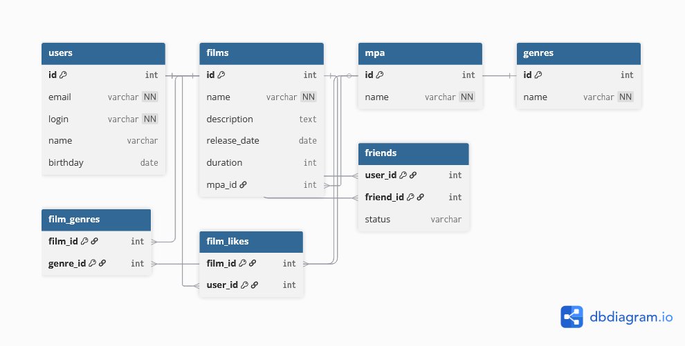

# 🎬 Filmorate

Учебный проект для работы с пользователями и фильмами.  
На текущем этапе добавлена поддержка **жанров**, **возрастных рейтингов (MPA)** и **статуса дружбы**.

---

## 📊 Схема базы данных



---

## 📝 Пояснения к схеме

- **users** — хранит пользователей.  
- **films** — хранит фильмы с указанием рейтинга MPA.  
- **genres** — справочник жанров.  
- **film_genres** — связь «многие ко многим» между фильмами и жанрами.  
- **friendships** — хранит друзей пользователей и статус (подтверждено / не подтверждено).  
- **film_likes** — таблица для лайков фильмов.  

---

## 🔍 Примеры SQL-запросов

### 1. Получить топ-10 популярных фильмов
```sql
SELECT f.id, f.name, COUNT(fl.user_id) AS likes
FROM films f
LEFT JOIN film_likes fl ON f.id = fl.film_id
GROUP BY f.id, f.name
ORDER BY likes DESC
LIMIT 10;
```
### 2. Найти общих друзей двух пользователей
```sql
SELECT u.id, u.login, u.name
FROM friendships f1
JOIN friendships f2 ON f1.friend_id = f2.friend_id
JOIN users u ON u.id = f1.friend_id
WHERE f1.user_id = 1 AND f2.user_id = 2
AND f1.status = 'CONFIRMED' AND f2.status = 'CONFIRMED';
```

### 3. Получить все фильмы определённого жанра
```sql
SELECT f.id, f.name
FROM films f
JOIN film_genres fg ON f.id = fg.film_id
JOIN genres g ON fg.genre_id = g.id
WHERE g.name = 'Комедия';
```